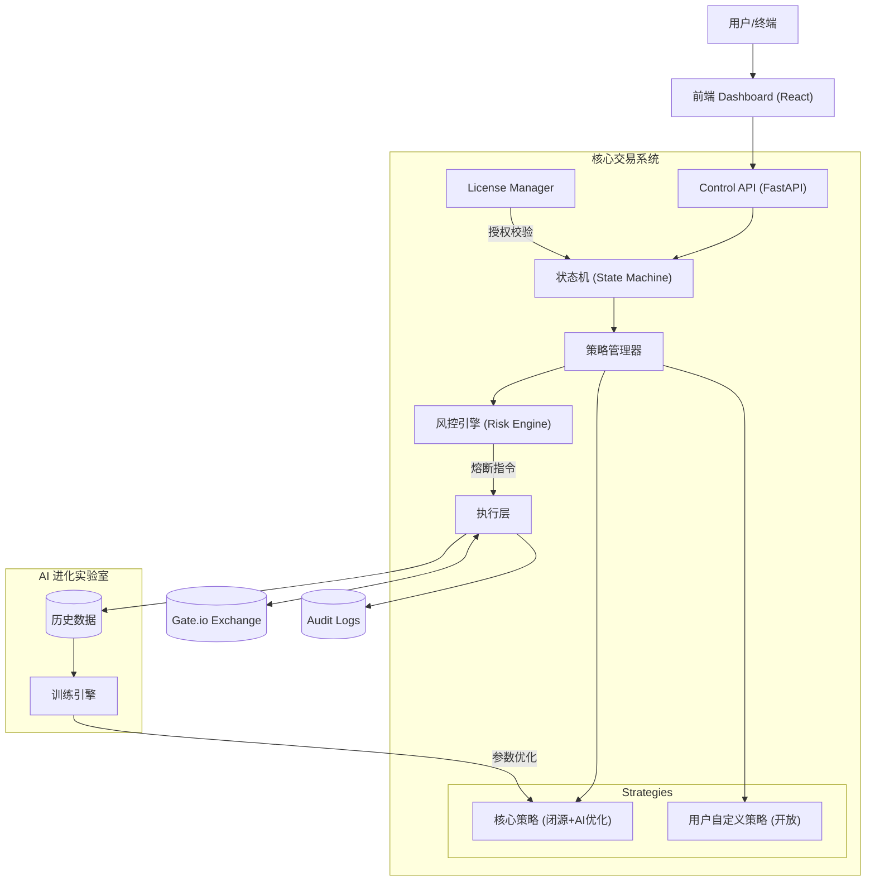
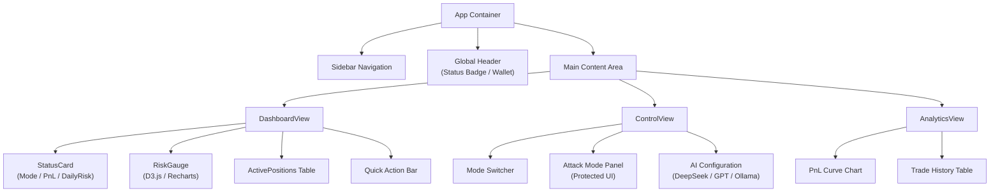

# 《Gate Attack Quant Bot》产品白皮书
> **版本**: V2.2 Commercial (AI-Evolution & UX-Enhanced Edition)  
> **定位**: 进攻型合约量化机器人（闭源商业版 + 开放策略接口）  
> **核心哲学**: 在结构优势期激进进攻，在风险期强制撤退，以纪律换取利润密度。

---

## 一、 产品总体定义 (Product Definition)

### 1.1 核心价值
一款**完全闭源**、**受 License 控制**、**支持试用**且**具备进化能力**的本地化高频量化系统。
它不仅是一套带风控熔断机制的自动化交易武器，更是一个**开放的策略进化容器**——支持用户注入自定义逻辑，并由 AI 持续训练优化核心策略。
**核心卖点**：不是让你赌得更猛，而是让你在该猛的时候，不会因为一时冲动毁掉全部。

### 1.2 产品形态
| 属性 | 说明 |
| :--- | :--- |
| **部署方式** | 本地运行 / 私有云部署 / **One-Click Docker** |
| **交付形式** | 二进制可执行文件 (PyInstaller + PyArmor 混淆) |
| **前端交互** | 本地 Web Dashboard (React + FastAPI) |
| **开放接口** | 支持用户自定义策略插件 (Python/Config) |
| **AI 进化** | 核心策略具备自我学习与参数迭代能力 |
| **授权模式** | 离线 License 文件 + RSA 非对称加密校验 |
| **商业模式** | 订阅制 (Free / Pro / Elite / Private) |

### 1.3 目标用户画像
*   **激进型个人交易者**：追求高盈亏比，但苦于执行力不足。
*   **高阶量化玩家**：有自己的交易理念，希望基于成熟的风控框架实现自定义策略。
*   **工作室/基金**：需要多账号管理且风控严格的底层执行系统。

---

## 二、 系统总体架构 (System Architecture)

系统采用 **模块化微服务架构**，确保各组件解耦，并新增 **策略沙箱 (Strategy Sandbox)** 与 **AI 训练环 (AI Training Loop)**。



---

## 三、 商业授权系统 (License System)

### 3.1 核心安全机制
基于 **RSA-2048 非对称加密** 与 **多重设备指纹** 技术，确保 License 不可伪造、不可复制、不可篡改。

### 3.2 License 数据结构
```json
{
  "license_id": "UUID-v4",
  "user_id": "Customer_Hash",
  "machine_fingerprint": "SHA256(CPU_ID + MAC + DISK_UUID)",
  "license_type": "MONTHLY | YEARLY | LIFETIME",
  "issued_at": 1700000000,
  "expires_at": 1702592000,
  "signature": "Base64_RSA_Signature"
}
```

---

## 四、 核心交易引擎 (Core Trading Engine)

### 4.1 状态机设计 (State Machine)
系统由状态机驱动，确保在任何时刻系统的行为都是**确定性**的。

| 状态 | 描述 | 触发条件 | 允许操作 |
| :--- | :--- | :--- | :--- |
| **OBSERVE** | 观察模式 | 初始化 / 市场无机会 | 仅行情订阅，无交易 |
| **NEUTRAL** | 中性震荡 | 波动率低，无明显趋势 | 高频、小仓位、均值回归 |
| **ATTACK** | 进攻模式 | 趋势确认 (量价配合) | **重仓、趋势跟随、金字塔加仓** |
| **COOL_DOWN** | 冷静期 | 触发软风控 / 连续亏损 | 停止开仓，维持现有仓位或减仓 |
| **LOCKED** | 锁定模式 | License 失效 / 触发硬风控 | **强制平仓，禁止一切操作** |

### 4.2 策略体系 (Strategy Ecosystem)
> **⚠️ 风险免责声明 (Risk Disclaimer)**  
> 无论是官方提供的核心策略，还是用户自定义的策略，**均不保证 100% 盈利**。市场具有不确定性，策略本质是概率博弈工具。

#### 4.2.1 核心策略 (Core Strategy - AI Optimized)
官方维护的闭源策略，由 AI 持续优化参数。
*   **Neutral Strategy**: 布林带/RSI 回归，赚取震荡收益。
*   **Attack Strategy**: 多周期共振 + 爆量突破，捕捉单边行情。

#### 4.2.2 用户自定义策略 (User Custom Strategy)
*   **实现方式**: Python 脚本插件 或 JSON 规则配置。
*   **能力边界**:
    *   ✅ 读取实时 K 线 / 深度数据。
    *   ✅ 定义开平仓信号逻辑。
    *   ❌ **不可绕过系统级风控 (Hard Risk Limits)**。

#### 4.2.3 策略市场 (Strategy Marketplace)
*   **共享经济**: 允许用户将自己的 `user_custom` 策略打包上传。
*   **验证机制**: 所有上架策略需经过官方 30 天实盘“影子模式”验证。
*   **分成模式**: 策略提供者可获得订阅该策略用户利润的 10-20% 分成。

### 4.3 风控引擎 (Risk Engine)
**不可绕过的硬约束**（对所有策略生效）：
1.  **每日回撤熔断**：当日亏损达到 8% -> `COOL_DOWN`；达到 15% -> `LOCKED`。
2.  **单笔风险上限**：单笔交易止损金额不得超过总资金的 2%。
3.  **同结构风险**：同一逻辑/同一相关性的币种，总风险敞口不超过 5%。

#### 4.3.1 紧急逃生通道 (Panic Button)
*   **物理层**: 支持绑定 Telegram Bot，在 Web 端无法访问时，通过 TG 发送 `/panic` 指令强制平仓。
*   **硬件层**: 支持 Stream Deck 物理按键集成。

### 4.4 影子验证系统 (Shadow Validation System)
在实盘运行的同时，后台运行一个“影子策略”。
*   影子策略的参数更加激进或使用了新的 AI 模型。
*   系统只记录影子策略的**理论盈亏**，不进行实际下单。
*   **价值**: 只有当影子策略在连续 N 天的胜率超过实盘策略时，才建议用户切换。

### 4.5 智能执行算法 (Smart Execution)
*   **适用**: Private / Whale 用户。
*   **算法**:
    *   **TWAP (时间加权)**: 大单拆分，减少对盘口冲击。
    *   **Iceberg (冰山委托)**: 隐藏真实挂单量，防止被猎杀。
    *   **Sniper (狙击模式)**: 毫秒级抢跑，捕捉插针行情。

---

## 五、 AI 增强与进化 (AI Evolution Layer)

> **定位**: AI 不仅是过滤器，更是核心策略的 **训练师 (Trainer)**。

### 5.1 信号评分 (Signal Scoring)
*   AI 对每一次开仓信号进行 `0-100` 评分。
*   **低分拦截**: 过滤掉历史回测中期望值为负的垃圾信号。

### 5.2 持续学习与策略进化 (Continuous Learning)
AI 模块会根据实盘数据和最新市场行情，对 **核心策略** 进行在线/离线训练。
1.  **数据采集**: 记录每一次策略的 开仓点位、市场状态、最终盈亏。
2.  **模式识别**: 识别当前策略在哪些市场环境下失效。
3.  **参数寻优**: AI 自动调整策略参数（如 RSI 阈值、均线周期、止损宽窄）。
4.  **模型更新**: 生成新的策略权重文件，平滑热更新到交易引擎中。

### 5.3 多模型兼容与配置 (Multi-Model Architecture)
**BYOK (Bring Your Own Key)**: 用户掌握控制权，自行配置 API Key，直连模型厂商，无中间商赚差价。

#### 支持模型列表 (Model Zoo)
| 模型 | 特点 | 适用场景 |
| :--- | :--- | :--- |
| **🚀 DeepSeek-R1** | **推理增强 (Reasoning)** | **推荐**。极高的逻辑推演能力，适合复杂的行情结构分析与策略生成。 |
| **🧠 OpenAI GPT-4o** | 综合能力最强 | 适合兜底与通用场景，稳定性最高。 |
| **⚡ Claude 3.5 Sonnet** | 代码理解力强 | 适合优化自定义策略代码 (Code Review)。 |
| **🏠 Local LLM (Ollama)** | **隐私极致保护** | 本地运行 Llama 3 / Mistral，零数据外泄，适合敏感策略训练。 |

#### 配置方式
系统完全兼容 OpenAI 接口标准，理论上支持所有类 OpenAI 模型。
*   **Provider**: 选择预设模型或 "Custom"。
*   **Base URL**: `https://api.deepseek.com` (示例)。
*   **API Key**: 用户填入自己的 Key，本地加密存储。
*   **Model Name**: `deepseek-reasoner`, `gpt-4o`, `llama3:latest` 等。

### 5.4 情绪与舆情引擎 (Sentiment Engine)
*   **数据源**: 集成 CryptoPanic / Twitter API / Google Trends。
*   **AI 处理**: 使用 NLP 模型实时评分当前市场情绪 (-100 ~ +100)。
*   **应用**: 当情绪极端恐慌 (-80) 时，自动收紧止损或触发抄底逻辑。

---

## 六、 前端可视化与交互设计 (Frontend System & UX)

**设计目标**: "你卖的不是黑盒，是可解释的专业系统。"

### 6.1 页面结构图 (Page PRD)

#### 1️⃣ Dashboard（核心总览页）
*   **定位**: 80% 时间唯一需要看的页面。
*   **展示**: 当前模式 (OBSERVE/NEUTRAL/ATTACK)、今日盈亏 (PnL)、总仓位风险 %、风控警告状态。
*   **操作**:
    *   🔴 **Kill Switch**: 一键全平并停机（最高权限）。
    *   🟡 **Manual Observe**: 手动降级为观察模式。
    *   🟢 **Resume Auto**: 恢复自动托管。

#### 2️⃣ Trading Control（交易控制）
*   **定位**: 状态级控制，严禁手动干预单笔交易。
*   **功能**:
    *   启用/禁用 `NEUTRAL_MODE`。
    *   启用/禁用 `ATTACK_MODE` (需多重确认)。
    *   调整最大单日风险阈值（仅允许下调，不可上调）。
    *   调整冷静期时长（仅允许拉长）。
    *   **AI 配置面板**: 快速切换当前使用的 AI 模型 (DeepSeek/GPT-4)，查看 Token 消耗。

#### 3️⃣ Strategy Status（策略状态）
*   **展示**: 当前结构 ID、结构方向、结构存活时间、已消耗风险 %。
*   **解读**: 🟢 可继续 / 🟡 信号衰减 / 🔴 必须退出。

#### 4️⃣ Risk & Exposure（风险核心页）
*   **展示**: 账户权益、已用风险 %、同结构风险 %、单边风险 %、今日/历史最大回撤。
*   **时间线**: 记录所有风控事件（触发 ATTACK、触发降级、拒绝下单原因）。

#### 5️⃣ Analytics & Review（复盘分析）
*   **图表**: 净值曲线、盈亏分布、ATTACK_MODE 成功率、风控触发次数。

#### 6️⃣ AI Settings（AI 配置中心）
*   **模型选择**: 下拉选择 DeepSeek-R1 / GPT-4o / Claude 3.5 Sonnet / Ollama / Custom。
*   **连接配置**:
    *   API Endpoint (Base URL)
    *   API Key (掩码显示，支持重置)
    *   Model Name
*   **测试连接**: "Test Connection" 按钮，发送 Hello World 验证连通性。

### 6.2 前端组件级线框 (React Component Wireframes)

采用 React + Ant Design / Tailwind CSS 构建。



### 6.3 ATTACK_MODE 的 UI 防误触设计 (Safety UX)
`ATTACK_MODE` 意味着高杠杆与重仓，UI 必须防止用户因情绪化或误操作开启。

1.  **滑动解锁 (Slide to Confirm)**:
    *   弃用简单的 Toggle 开关。
    *   使用类似 iPhone 关机的滑动条：`>>>> Slide to ATTACK >>>>`。
2.  **视觉警示 (Visual Alarm)**:
    *   开启 ATTACK_MODE 后，整个 Dashboard 边缘出现**红色呼吸灯效果**。
    *   顶部状态栏变为醒目的红色背景。
3.  **二次确认模态框 (Double Confirmation Modal)**:
    *   滑动后弹出 Modal，强制显示当前风险提示：“当前操作将允许系统使用最高 5x 杠杆，最大风险敞口扩大至 50%。”
    *   需输入简短确认码（如 "CONFIRM"）或倒计时 3 秒后才可点击确认。
4.  **冷静期锁定**:
    *   如果刚经历了强制熔断，ATTACK_MODE 按钮将被物理锁定 (Disabled) 24小时，UI 上显示倒计时。

### 6.4 移动端伴侣 (Mobile Companion App)
*   **定位**: 非交易终端，而是“监控器 + 遥控器”。
*   **功能**:
    *   实时查看 Dashboard 关键数据。
    *   接收风控报警推送。
    *   **生物识别解锁**: FaceID 验证后才可使用 Kill Switch。

---

## 七、 API 接口定义与规范 (API Spec)

### 7.1 设计哲学
*   **风格**: RESTful API (FastAPI)
*   **文档**: 集成 Swagger / OpenAPI 自动生成文档
*   **鉴权**: Header `X-API-KEY` 校验

### 7.2 核心接口定义

#### 1️⃣ 系统状态 (System Status)
`GET /api/v1/system/status`
```json
{
  "mode": "ATTACK_MODE",
  "can_trade": true,
  "equity": 11235.50,
  "today_pnl": 125.30,
  "today_pnl_pct": 1.12,
  "used_risk_pct": 3.8,
  "risk_level": "HIGH"
}
```

#### 2️⃣ 交易控制 (Control)
`POST /api/v1/system/control`
```json
{
  "action": "ENABLE_ATTACK_MODE",
  "confirmation_token": "user_input_token" 
}
```

#### 3️⃣ Kill Switch (Emergency)
`POST /api/v1/system/kill`
*   **描述**: 最高优先级，绕过一切策略逻辑，强制清仓并停止。
*   **Body**: `{"reason": "manual_emergency"}`

#### 4️⃣ 风控详情 (Risk Status)
`GET /api/v1/risk/status`
```json
{
  "max_daily_drawdown": 8.5,
  "current_drawdown": 3.2,
  "risk_cap": 5.0,
  "risk_used": 3.8,
  "attack_risk_used": 4.5,
  "trading_allowed": true
}
```

#### 5️⃣ 交易历史 (History)
`GET /api/v1/trades?limit=100&mode=ATTACK_MODE`

#### 6️⃣ AI 配置接口
`POST /api/v1/system/ai_config`
```json
{
  "provider": "deepseek",
  "base_url": "https://api.deepseek.com",
  "api_key": "sk-xxxxxx",
  "model_name": "deepseek-reasoner"
}
```

### 7.3 OpenAPI / Swagger 文档
系统启动后自动在 `/docs` 和 `/redoc` 提供交互式文档。

**Swagger UI 概览**:
*   **Tags 分组**:
    *   `System`: 系统级控制 (Start/Stop/Kill)
    *   `Strategy`: 策略参数热更新
    *   `Risk`: 风控参数查询与调整
    *   `Market`: 行情数据快照
*   **Schema 定义**:
    *   所有请求与响应均包含严格的 Pydantic 类型定义。
    *   Example Value 覆盖所有枚举状态 (Status Enums)。

---

## 八、 商业定价与套餐设计 (Pricing)

> **核心理念**: 不是卖“收益”，而是卖“纪律与风控”。

| 套餐 | 价格 | 适用人群 | 核心权益 |
| :--- | :--- | :--- | :--- |
| **🟢 Free** <br> (体验版) | **$0** | 观望者 / 体验用户 | • 单一模式 (NEUTRAL)<br>• 单交易所 (Gate.io)<br>• 最大资金限制 $100<br>• 无 Dashboard (仅 CLI) |
| **🔵 Pro** <br> (主力版) | **$29 /月** | 个人量化玩家 | • **全模式支持 (NEUTRAL + ATTACK)**<br>• **完整 Web Dashboard**<br>• 最大资金 $10,000<br>• 基础风控可视化<br>• Telegram 报警通知 |
| **🔴 Elite** <br> (精英版) | **$79 /月** | 进攻型铁军 | • **高级 ATTACK 权限 (重仓)**<br>• **自定义风险上限 (仅向下)**<br>• 高级复盘分析 (Analytics)<br>• 优先获取 AI 策略更新<br>• 资金上限 $50,000 |
| **⚫ Private** <br> (定制版) | **$199+ /月** | 机构 / 工作室 | • 多交易所 / 多账户聚合<br>• 定制风控规则<br>• 专属技术支持<br>• 资金无上限 |

---

## 九、 目录结构 (Project Structure)

```bash
gate_attack_quant_bot/
├── bin/                  # 编译后的二进制文件
├── config/               # 配置文件 (yaml)
├── frontend/             # 前端静态资源 (React build)
├── strategies/           # 策略文件夹
│   ├── core/             # 核心策略 (闭源/编译态)
│   └── user_custom/      # 用户自定义策略 (开放源码)
├── ai_models/            # AI 模型权重
├── license/              # 授权文件
├── logs/                 # 审计日志
├── docs/                 # OpenAPI spec (generated)
└── main.py               # 入口文件
```

---

## 十、 最终封印语 (Product Philosophy)

我们允许激进，但不允许失控。
系统不是为了幻想倍数而存在，而是为了在对的时候，用尽全力。
无论核心算法如何进化，无论用户策略如何精妙，
**唯有风控，是永恒不变的底线。**

**Gate Attack Quant Bot** —— 以纪律换取自由，以进化适应市场，以风控换取生存。
