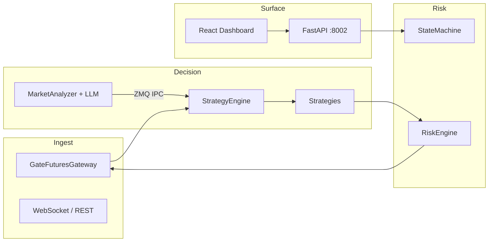

<div align="center">

# Shark Quantitative Robot

### Institutional-Grade Crypto Futures Intelligence · Gate.io USDT Perpetuals

*Precision execution. Layered risk. Observable state.*

[](https://www.python.org/)
[](https://fastapi.tiangolo.com/)
[](https://react.dev/)

</div>

---

## English

### Vision

**Shark Quantitative Robot** is a modular quantitative stack for USDT-margined perpetual futures. It couples low-latency market ingestion, a deterministic risk engine, multi-strategy orchestration, and optional LLM-assisted regime scoring—delivered behind a modern control surface suitable for research, paper trading, and controlled live deployment.

Design goals: **capital preservation first**, reproducible behaviour from configuration, and clear separation between *signal*, *risk*, and *execution*.

### Architecture (high level)



### Core capabilities

| Layer | Capability |
|--------|------------|
| **Execution** | Paper / live gateway abstraction, order lifecycle helpers, contract physics sync |
| **Strategies** | Pluggable engines (e.g. beta-neutral HF, slingshot, micro tactics) driven by `config/settings.yaml` |
| **Risk** | Drawdown, notional, and per-leg guards coordinated with the state machine |
| **AI (optional)** | Regime scoring, L1/L2 tuning hooks; isolatable worker process over ZeroMQ |
| **Observability** | Structured logging, REST + WebSocket API, Starship-style dashboard (Vite + React) |

### Requirements

- Python **3.10+** (3.11 recommended for production)
- Node **18+** for the frontend workspace
- Redis (optional; used when composing full stack via Docker)

### Quick start — backend

```bash
pip install -r requirements.txt
cp config/settings.model.yaml config/settings.yaml   # first run only; then edit secrets & symbols
export SHARK_CONFIG_PATH="${PWD}/config/settings.yaml"
python main.py
```

API defaults to **http://127.0.0.1:8002** (see `main.py` / uvicorn wiring).

### Quick start — dashboard

```bash
cd frontend
npm ci
npm run dev
```

### Configuration

Authoritative runtime config: **`config/settings.yaml`**. Set exchange credentials, symbol universe, strategy flags, Darwin / LLM blocks, and risk ceilings. Never commit real API secrets; use environment overrides or a private overlay file in CI.

### Docker

```bash
docker compose up -d --build
```

- Dashboard / API: **http://localhost:8002**
- Logs: `docker logs -f shark-quant-bot` and host-mapped `./logs/` when enabled in compose

### Source protection & obfuscation

1. **Runtime indirection** — IPC topic strings and related identifiers are resolved via `src/runtime_obf.py` so casual string search does not surface wire protocol tokens.
2. **Release obfuscation (recommended for IP-heavy builds)** — install optional tooling and generate a protected tree:

   ```bash
   pip install -r requirements-obfuscate.txt
   python scripts/obfuscate_release.py -O dist/obfuscated
   ```

   The script wraps **PyArmor** over `src/strategy`, `src/execution`, and any extra `-r` paths you pass. Distribute the output together with the `pyarmor_runtime_*` package PyArmor emits, on the **same Python minor version** used to build. Obfuscation is not a substitute for key management or exchange permission hardening.

### Commercial runtime license (RSA + device binding)

Distribution of **strategy bytecode** (optionally obfuscated) is orthogonal to **runtime authorization**:

| Artifact | Role |
|----------|------|
| `license/public.pem` | **RSA public key** embedded with the bot; verifies detached signatures over the license payload. Safe to ship in the repository (private key stays offline). |
| `license/license.key` | **Signed JSON** (`LicenseData`): expiry, license type, **machine fingerprint**, and **PSS-SHA256** signature over the canonical payload. Issued by the author; never commit real keys. |
| `SKIP_LICENSE_CHECK=1` | **Development bypass** only. Skips import-time and API-side checks; **must not** be used in production. |

**Verification chain:** `LicenseValidator` reconstructs the signed JSON (excluding `signature`), verifies with the public key, checks `expires_at`, then compares `machine_fingerprint` to `MachineFingerprint.get_fingerprint()`. The strategy engine calls `assert_strategy_runtime_allowed()` at import; `main.py` enforces the same invariant before live operation.

**Authoring keys (vendor machine):** `python tools/generate_keys.py` emits `license/private.pem` + `license/public.pem`. **Signing licenses:** use the companion tooling that hashes the payload with the private key (see `tools/` for `generate_license.py` if present). **Dashboard:** `GET /api/license/status` exposes `license_status_payload()` for the React shell; without a valid license the UI shows a **Chinese-first** overlay directing users to contact the author.

### Configuration contract (`settings.model.yaml` vs `settings.yaml`)

| File | Git | Purpose |
|------|-----|---------|
| `config/settings.model.yaml` | **Tracked** | Schema-complete **template** with safe defaults (empty API keys, sanitized exchange block). Clone → copy → edit. |
| `config/settings.yaml` | **Ignored** | **Authoritative** runtime file: credentials, symbol universe, strategy allocations, Darwin/LLM blocks, risk ceilings. |

If `settings.yaml` is missing, `config_manager` falls back to `settings.model.yaml` and logs that you are on the template. Production deployments should always materialize a private `settings.yaml` (or set `SHARK_CONFIG_PATH`).

### Strategy surface — terminology & primary knobs

The orchestration layer (`StrategyEngine`) multiplexes **playbook-weighted** tactics under the global **risk engine** and **state machine**. The following is a concise **control-plane** glossary aligned with `config/settings.model.yaml`:

| Block | Role | Representative parameters |
|-------|------|---------------------------|
| `strategy.active_strategies` / `allocations` | **Capital budget** across named engines (e.g. `core_neutral`, `core_attack`). | `allocations` must sum to the intended exposure budget; `single_open_per_symbol` enforces **one net position per symbol**. |
| `strategy.params` | **Core discretionary** thresholds for mean-reversion vs breakout legs. | `neutral_rsi_*`, `attack_ai_threshold`, `*_signal_cooldown_sec`, bracket knobs `core_entry_tp_bps` / `core_entry_sl_bps`, **ATR regime** widen `core_atr_sl_widen_mult`, **breakeven** `core_breakeven_arm_r`. |
| `beta_neutral_hf` | **Stat-arb style** pair trading: beta-adjusted spreads, **z-score** entry/exit bands, **cross-section** filters. | `entry_zscore`, `exit_zscore`, `stop_zscore`, `min_correlation`, `pair_leverage`, `max_hold_sec`, **micro take-profit** `leg_micro_take_usdt`, **trend / micro-trend** guards. |
| `playbook` | **Regime-conditioned** routing: switches between **matrix** vs **guerrilla** posture by equity and volatility. | `matrix_capital_threshold_usdt`, `matrix_volatility_threshold_pct`, `guerrilla_leverage`, `position_ttl_minutes`. |
| `market_oracle` | **Cross-exchange** stress / crowding signals (funding, OBI crash anchor). | `crowded_ls_ratio`, `crash_max_anchor_return_pct`, `long_obi_veto_max`. |
| `risk` | **Hard limits**: per-trade and structure risk, drawdown brakes, **berserker** OBI gate. | `max_single_risk`, `daily_drawdown_limit`, `hard_drawdown_limit`, `berserker_obi_threshold`, `drawdown_cool_down_sec`. |
| `paper_engine` | **Simulation physics**: fees, slippage, optional **bracket** enforcement, liquidation buffer. | `taker_fee_rate` / `maker_fee_rate`, `require_entry_tp_sl_limits`, `isolated_liquidation_maintenance_buffer`. |
| `execution` | **Order style** and **Kelly-style** sizing caps for tactical modules. | `kelly_fraction`, `max_allowed_leverage`, **sniper** TTL `sniper_normal_ttl_ms`, **trailing** `high_conviction_trailing_activation_pct`. |

This is **not** an exhaustive parameter list; treat `settings.model.yaml` as the **ground truth** for defaults and comments in your tree.

### Disclaimer

Trading digital asset derivatives involves **substantial risk of loss**. This software is provided for research and educational purposes; you are solely responsible for compliance, capital, and operational safety. Past backtests or paper results do not guarantee future performance.

### License

See repository `LICENSE` if present; otherwise treat usage terms as project-local until clarified.

---

## 中文

### 愿景

**Shark Quantitative Robot（鲨鱼量化机器人）** 面向 USDT 本位永续合约，构建「行情接入 → 策略决策 → 风控闸门 → 执行网关」的分层架构，并可接入 LLM 做盘面体制 / 打分与 L1/L2 参数调节。目标是在 **可控风险** 前提下，追求可复现、可审计、可观测的自动化交易行为。

### 架构概览

与上文 English 小节中的 **Architecture** Mermaid 图一致：网关驱动策略引擎；AI 进程经 **ZeroMQ** 向主进程投递分数与调参事件；风控与状态机贯穿下单路径；FastAPI + React 提供控制与可视化平面。

### 核心能力（摘要）

- **执行层**：纸 / 实网关抽象、订单与合约规格同步  
- **策略层**：多策略可插拔，由 `config/settings.yaml` 统一编排  
- **风控层**：回撤、名义、单腿限制与状态机协同  
- **智能层（可选）**：独立 AI 子进程，降低与主循环的耦合  
- **观测层**：日志、HTTP/WebSocket API、前端指挥舱

### 环境要求

- Python **3.10+**（生产建议 3.11）  
- 前端 **Node 18+**  
- 全栈 Docker 场景下可配合 **Redis**（见 `docker-compose.yml`）

### 快速启动 — 后端

```bash
pip install -r requirements.txt
cp config/settings.model.yaml config/settings.yaml   # 首次克隆后复制模板并编辑密钥与品种
export SHARK_CONFIG_PATH="${PWD}/config/settings.yaml"
python main.py
```

默认 API：**http://127.0.0.1:8002**

### 快速启动 — 前端

```bash
cd frontend
npm ci
npm run dev
```

### 配置说明

主配置：**`config/settings.yaml`**。交易所密钥、品种池、策略开关、Darwin/LLM、风险参数均在此集中管理。**切勿**将真实 Key 提交到公共仓库；生产环境建议使用环境变量或私有配置覆盖。

### Docker 部署

```bash
docker compose up -d --build
```

浏览器访问 **http://localhost:8002**；容器日志 `docker logs -f shark-quant-bot`，若已映射 `./logs/` 可在宿主机持久化查看。

### 源码保护与混淆策略

1. **运行时常量混淆**：进程间控制类字符串经 `src/runtime_obf.py` 解码后再使用，避免在源码中直接出现明文话题名。  
2. **发布级混淆（PyArmor）**：对策略与执行等核心目录做商业级混淆输出，命令如下：

   ```bash
   pip install -r requirements-obfuscate.txt
   python scripts/obfuscate_release.py -O dist/obfuscated
   ```

   默认递归处理 `src/strategy`、`src/execution`；可通过脚本参数追加更多 `-r` 路径。发布时需连同 PyArmor 生成的 **`pyarmor_runtime_*`** 一并分发，且运行环境 Python **次版本**应与构建环境一致。混淆不能替代密钥管理与交易所侧权限最小化。

### 商业运行时许可证（RSA + 设备指纹）

| 文件 | 作用 |
|------|------|
| `license/public.pem` | **RSA 公钥**，随程序分发，用于校验 `license.key` 内嵌的 **PSS-SHA256** 签名。 |
| `license/license.key` | **JSON 许可证**：到期时间、类型、**机器指纹**、签名域；由创作者离线签发，**切勿**提交仓库。 |
| `SKIP_LICENSE_CHECK=1` | 仅用于 **本地开发/CI**，跳过 import 与 API 侧校验；**禁止**在生产环境使用。 |

**校验顺序**：验签 → 过期检查 → 指纹比对。策略引擎在 import 时执行 `assert_strategy_runtime_allowed()`；`main.py` 在启动路径上再次保证一致性。前端通过 **`GET /api/license/status`** 拉取状态；无有效授权时展示 **中文引导**，提示向创作者申请 `license.key`。

**密钥生成**：`python tools/generate_keys.py` 在 `license/` 下生成公私钥对；**私钥**仅用于签发，留在离线环境。

### 配置文件约定（`settings.model.yaml` 与 `settings.yaml`）

| 文件 | 是否入库 | 说明 |
|------|----------|------|
| `config/settings.model.yaml` | **是** | 完整字段的 **默认模板**（密钥位留空），可安全提交。 |
| `config/settings.yaml` | **否**（gitignore） | **真实运行配置**：API Key、品种池、策略与风控参数。首次使用请 `cp config/settings.model.yaml config/settings.yaml` 后编辑。 |

若缺少 `settings.yaml`，`config_manager` 会回退加载模板并打日志提示。

### 策略控制面 — 术语与主参数（对照 `settings.model.yaml`）

| 模块 | 职责 | 典型参数 |
|------|------|----------|
| `strategy.active_strategies` / `allocations` | 多引擎 **资金权重** 与 **互斥** 约束 | `allocations`、`single_open_per_symbol`、`regime_switch_anchor_symbol` |
| `strategy.params` | **Core** 均值回归 / 追击腿 的阈值与 **括号单** | `neutral_rsi_*`、`attack_ai_threshold`、`*_cooldown_sec`、`core_entry_tp_bps` / `core_entry_sl_bps`、高波动 **ATR** 放宽 `core_atr_sl_widen_mult` |
| `beta_neutral_hf` | **配对统计套利**：价差 z-score、相关性、截面筛选 | `entry_zscore`、`exit_zscore`、`min_correlation`、`pair_leverage`、`max_hold_sec`、`leg_micro_take_usdt` |
| `playbook` | **体制路由**（矩阵 / 游击）按权益与波动切换 | `matrix_capital_threshold_usdt`、`guerrilla_leverage`、`position_ttl_minutes` |
| `market_oracle` | **跨所** 拥挤度、崩盘锚、OBI 否决 | `crowded_funding_rate_min`、`crash_max_anchor_return_pct` |
| `risk` | **硬风控**：回撤、结构风险、狂暴模式门槛 | `daily_drawdown_limit`、`berserker_obi_threshold`、`drawdown_cool_down_sec` |
| `paper_engine` | 纸面 **费率/滑点/强平** 与可选 **开仓括号** 约束 | `taker_fee_rate`、`require_entry_tp_sl_limits` |
| `execution` | 订单风格与 **Kelly** 相关上限 | `kelly_fraction`、`max_allowed_leverage`、狙击单 TTL 等 |

完整默认值与字段说明以仓库内 **`config/settings.model.yaml`** 为准。

### 风险提示

数字资产衍生品交易可能导致 **本金全部损失**。本软件仅供研究与学习参考；合规、资金安全与运维责任由使用者自行承担。历史回测或纸面表现 **不构成** 未来收益承诺。

### 许可

若仓库包含 `LICENSE` 文件则从其约定；否则在明确许可前请仅作内部评估使用。

---

<div align="center">

**Shark Quantitative Robot** · *Measure twice, execute once.*

</div>
