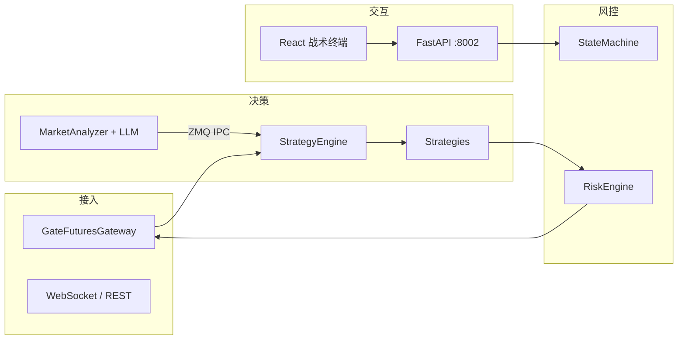

<div align="center">

# Shark Quantitative Robot

###  Gate.io USDT 永续

*分层风控 · 可配置编排 · 可观测状态*

[](https://www.python.org/)
[](https://fastapi.tiangolo.com/)
[](https://react.dev/)

</div>

---

## 产品定位

**Shark Quantitative Robot（鲨鱼量化机器人）** 面向 USDT 本位永续合约，采用「行情接入 → 策略决策 → 风控闸门 → 执行网关」分层架构，可选接入 LLM 做盘面体制判别、打分与 L1/L2 调参。设计目标：在 **资本保全优先** 前提下，实现行为可复现、参数可审计、运行可观测。

## 架构概览



## 核心能力

| 层级 | 能力 |
|------|------|
| **执行** | 纸面 / 实盘网关抽象、订单生命周期、合约规格同步 |
| **策略** | 可插拔引擎（如 Beta 中性高频、弹射、微观战术等），由 `config/settings.yaml` 编排 |
| **风控** | 回撤、名义、单腿限制与状态机协同 |
| **智能（可选）** | 体制打分、L1/L2 调参；独立进程经 ZeroMQ 与主循环解耦 |
| **观测** | 结构化日志、REST + WebSocket API、前端指挥舱 |

## 环境要求

- Python **3.10+**（生产建议 3.11）
- Node **18+**（前端工程）
- 全栈 Docker 场景可配合 **Redis**（见 `docker-compose.yml`）

## 快速启动 — 后端

```bash
pip install -r requirements.txt
cp config/settings.model.yaml config/settings.yaml
# 编辑 settings.yaml：填入交易所密钥、品种池、策略与风控参数
export SHARK_CONFIG_PATH="${PWD}/config/settings.yaml"
python main.py
```

默认 API：**http://127.0.0.1:8002**

## 快速启动 — 前端

```bash
cd frontend
npm ci
npm run dev
```

开发模式下 Vite 将 `/api`、`/ws` 代理至 `127.0.0.1:8002`，需先启动后端。

## 配置文件约定

| 文件 | 是否入库 | 说明 |
|------|----------|------|
| `config/settings.model.yaml` | **是** | 字段齐全的 **默认模板**（密钥位留空），可安全提交。 |
| `config/settings.yaml` | **否**（`.gitignore`） | **实际运行配置**：API Key、品种池、策略与风控参数。 |

若缺少 `settings.yaml`，配置管理器会回退加载模板并记录日志。**切勿**将真实密钥提交公共仓库。

## Docker

```bash
docker compose up -d --build
```

浏览器访问 **http://localhost:8002**；日志可用 `docker logs -f shark-quant-bot`，若已映射 `./logs/` 可在宿主机查看。

## 策略控制面 — 术语与主参数

以下与 `config/settings.model.yaml` 对齐，便于理解各模块职责与调参入口；完整默认值以仓库内该文件为准。

| 模块 | 职责 | 典型参数 |
|------|------|----------|
| `strategy.active_strategies` / `allocations` | 多引擎 **资金权重** 与 **单品种单仓** 约束 | `allocations`、`single_open_per_symbol`、`regime_switch_anchor_symbol` |
| `strategy.params` | **Core** 均值回归 / 追击腿 阈值与 **括号止盈止损** | `neutral_rsi_*`、`attack_ai_threshold`、`*_cooldown_sec`、`core_entry_tp_bps` / `core_entry_sl_bps`、高波动下 **ATR** 放宽 `core_atr_sl_widen_mult`、保本 `core_breakeven_arm_r` |
| `beta_neutral_hf` | **配对统计套利**：价差 z-score、相关性、截面筛选 | `entry_zscore`、`exit_zscore`、`min_correlation`、`pair_leverage`、`max_hold_sec`、`leg_micro_take_usdt` |
| `playbook` | **体制路由**（矩阵 / 游击）按权益与波动切换 | `matrix_capital_threshold_usdt`、`guerrilla_leverage`、`position_ttl_minutes` |
| `market_oracle` | **跨所** 拥挤度、崩盘锚、OBI 否决 | `crowded_funding_rate_min`、`crash_max_anchor_return_pct` |
| `risk` | **硬风控**：回撤、结构风险、狂暴模式门槛 | `daily_drawdown_limit`、`berserker_obi_threshold`、`drawdown_cool_down_sec` |
| `paper_engine` | 纸面 **费率 / 滑点 / 强平** 与可选 **开仓括号** | `taker_fee_rate`、`require_entry_tp_sl_limits` |
| `execution` | 订单风格与 **Kelly** 类规模上限 | `kelly_fraction`、`max_allowed_leverage`、狙击单 TTL 等 |

## 风险提示

数字资产衍生品交易可能导致 **本金全部损失**。本软件仅供研究与学习参考；合规、资金安全与运维责任由使用者自行承担。历史回测或纸面表现 **不构成** 未来收益承诺。

## 开源许可

若仓库包含 `LICENSE` 文件则从其约定；否则在明确许可前请仅作内部评估使用。

---

<div align="center">

**Shark Quantitative Robot** · 谋定而后动

</div>
