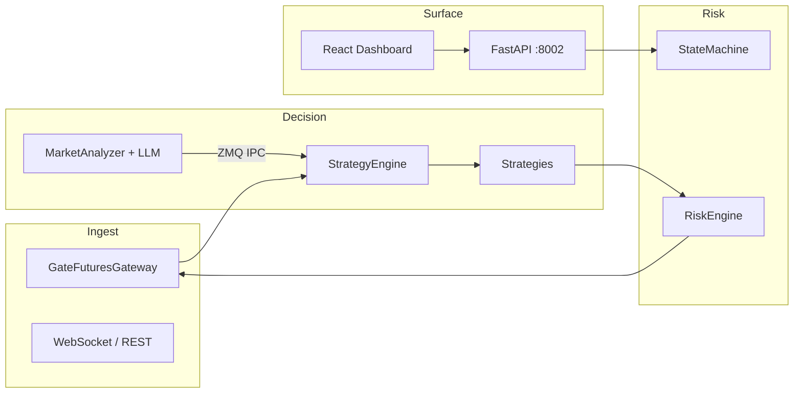

<div align="center">

# Shark Quantitative Robot

### Institutional-Grade Crypto Futures Intelligence · Gate.io USDT Perpetuals

*Precision execution. Layered risk. Observable state.*

[](https://www.python.org/)
[](https://fastapi.tiangolo.com/)
[](https://react.dev/)

</div>

---

## English

### Vision

**Shark Quantitative Robot** is a modular quantitative stack for USDT-margined perpetual futures. It couples low-latency market ingestion, a deterministic risk engine, multi-strategy orchestration, and optional LLM-assisted regime scoring—delivered behind a modern control surface suitable for research, paper trading, and controlled live deployment.

Design goals: **capital preservation first**, reproducible behaviour from configuration, and clear separation between *signal*, *risk*, and *execution*.

### Architecture (high level)



### Core capabilities

| Layer | Capability |
|--------|------------|
| **Execution** | Paper / live gateway abstraction, order lifecycle helpers, contract physics sync |
| **Strategies** | Pluggable engines (e.g. beta-neutral HF, slingshot, micro tactics) driven by `config/settings.yaml` |
| **Risk** | Drawdown, notional, and per-leg guards coordinated with the state machine |
| **AI (optional)** | Regime scoring, L1/L2 tuning hooks; isolatable worker process over ZeroMQ |
| **Observability** | Structured logging, REST + WebSocket API, Starship-style dashboard (Vite + React) |

### Requirements

- Python **3.10+** (3.11 recommended for production)
- Node **18+** for the frontend workspace
- Redis (optional; used when composing full stack via Docker)

### Quick start — backend

```bash
pip install -r requirements.txt
export SHARK_CONFIG_PATH="${PWD}/config/settings.yaml"
python main.py
```

API defaults to **http://127.0.0.1:8002** (see `main.py` / uvicorn wiring).

### Quick start — dashboard

```bash
cd frontend
npm ci
npm run dev
```

### Configuration

Authoritative runtime config: **`config/settings.yaml`**. Set exchange credentials, symbol universe, strategy flags, Darwin / LLM blocks, and risk ceilings. Never commit real API secrets; use environment overrides or a private overlay file in CI.

### Docker

```bash
docker compose up -d --build
```

- Dashboard / API: **http://localhost:8002**
- Logs: `docker logs -f shark-quant-bot` and host-mapped `./logs/` when enabled in compose

### Source protection & obfuscation

1. **Runtime indirection** — IPC topic strings and related identifiers are resolved via `src/runtime_obf.py` so casual string search does not surface wire protocol tokens.
2. **Release obfuscation (recommended for IP-heavy builds)** — install optional tooling and generate a protected tree:

   ```bash
   pip install -r requirements-obfuscate.txt
   python scripts/obfuscate_release.py -O dist/obfuscated
   ```

   The script wraps **PyArmor** over `src/strategy`, `src/execution`, and any extra `-r` paths you pass. Distribute the output together with the `pyarmor_runtime_*` package PyArmor emits, on the **same Python minor version** used to build. Obfuscation is not a substitute for key management or exchange permission hardening.

### Disclaimer

Trading digital asset derivatives involves **substantial risk of loss**. This software is provided for research and educational purposes; you are solely responsible for compliance, capital, and operational safety. Past backtests or paper results do not guarantee future performance.

### License

See repository `LICENSE` if present; otherwise treat usage terms as project-local until clarified.

---

## 中文

### 愿景

**Shark Quantitative Robot（鲨鱼量化机器人）** 面向 USDT 本位永续合约，构建「行情接入 → 策略决策 → 风控闸门 → 执行网关」的分层架构，并可接入 LLM 做盘面体制 / 打分与 L1/L2 参数调节。目标是在 **可控风险** 前提下，追求可复现、可审计、可观测的自动化交易行为。

### 架构概览

与上文 English 小节中的 **Architecture** Mermaid 图一致：网关驱动策略引擎；AI 进程经 **ZeroMQ** 向主进程投递分数与调参事件；风控与状态机贯穿下单路径；FastAPI + React 提供控制与可视化平面。

### 核心能力（摘要）

- **执行层**：纸 / 实网关抽象、订单与合约规格同步  
- **策略层**：多策略可插拔，由 `config/settings.yaml` 统一编排  
- **风控层**：回撤、名义、单腿限制与状态机协同  
- **智能层（可选）**：独立 AI 子进程，降低与主循环的耦合  
- **观测层**：日志、HTTP/WebSocket API、前端指挥舱

### 环境要求

- Python **3.10+**（生产建议 3.11）  
- 前端 **Node 18+**  
- 全栈 Docker 场景下可配合 **Redis**（见 `docker-compose.yml`）

### 快速启动 — 后端

```bash
pip install -r requirements.txt
export SHARK_CONFIG_PATH="${PWD}/config/settings.yaml"
python main.py
```

默认 API：**http://127.0.0.1:8002**

### 快速启动 — 前端

```bash
cd frontend
npm ci
npm run dev
```

### 配置说明

主配置：**`config/settings.yaml`**。交易所密钥、品种池、策略开关、Darwin/LLM、风险参数均在此集中管理。**切勿**将真实 Key 提交到公共仓库；生产环境建议使用环境变量或私有配置覆盖。

### Docker 部署

```bash
docker compose up -d --build
```

浏览器访问 **http://localhost:8002**；容器日志 `docker logs -f shark-quant-bot`，若已映射 `./logs/` 可在宿主机持久化查看。

### 源码保护与混淆策略

1. **运行时常量混淆**：进程间控制类字符串经 `src/runtime_obf.py` 解码后再使用，避免在源码中直接出现明文话题名。  
2. **发布级混淆（PyArmor）**：对策略与执行等核心目录做商业级混淆输出，命令如下：

   ```bash
   pip install -r requirements-obfuscate.txt
   python scripts/obfuscate_release.py -O dist/obfuscated
   ```

   默认递归处理 `src/strategy`、`src/execution`；可通过脚本参数追加更多 `-r` 路径。发布时需连同 PyArmor 生成的 **`pyarmor_runtime_*`** 一并分发，且运行环境 Python **次版本**应与构建环境一致。混淆不能替代密钥管理与交易所侧权限最小化。

### 风险提示

数字资产衍生品交易可能导致 **本金全部损失**。本软件仅供研究与学习参考；合规、资金安全与运维责任由使用者自行承担。历史回测或纸面表现 **不构成** 未来收益承诺。

### 许可

若仓库包含 `LICENSE` 文件则从其约定；否则在明确许可前请仅作内部评估使用。

---

<div align="center">

**Shark Quantitative Robot** · *Measure twice, execute once.*

</div>
