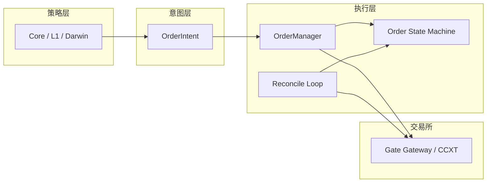

# Quant + AI 架构升级指南（阶段二蓝图）

本文档承接对 `vendor_repos` 中 **CCXT、Hummingbot、Freqtrade/FreqAI、VectorBT** 的设计提炼，并对照当前仓库（`src/strategy/engine.py`、`src/exchange/gate_gateway.py`、`src/core/paper_engine.py`、`src/ai/*`、`src/darwin/*`）给出**可落地的重构蓝图**。  
目标：把「点火式下单 + 文本算命 LLM + 理想化纸面」升级为「订单状态机 + 特征/小模型 + 风控型 LLM + 高摩擦仿真」。

---

## 总览：三条主线

| 主线 | 问题 | 对标能力 | 落地位置（建议） |
|------|------|----------|------------------|
| **A. 执行与对账** | 策略直接 `create_order`，无生命周期 | Hummingbot 订单状态机 + CCXT 容错 | `src/execution/order_manager.py`（新） + `StrategyEngine` 委托 |
| **B. 特征与 AI 职责** | OHLCV 文本喂 LLM，易幻觉、难验证 | FreqAI 特征管道 + 小模型 + 漂移意识 | `src/features/`（新） + `src/ai/` 收敛 |
| **C. 纸面逼真度** | 手续费/VWAP 有，资金费/排队/极端滑点弱 | VectorBT 式可复现实验纪律 + 摩擦模型 | `src/core/paper_engine.py` 分阶段补丁 |



---

## A. Hummingbot 式：OrderManager + 状态机 + 防御撤单 + 对账

### A.1 设计原则（从顶级开源抽象）

- **Hummingbot**：每个交易所订单有**可见状态**；策略不假设「一发即成」；撤单/改价是**一等公民**。
- **CCXT**：`enableRateLimit`、错误分类、异步；订单需 `clientOrderId` 幂等（便于对账与重试）。

### A.2 状态机（最小完备集）

> 与交易所原始状态映射时允许子集合并（例如 Gate 返回 `open`/`finished`），本地统一为：

```
PENDING_CREATE → SUBMITTED → OPEN → PARTIALLY_FILLED → FILLED
                              ↓           ↓
                         CANCELING → CANCELED
                              ↓
                           FAILED / REJECTED
```

**约束：**

- 任意时刻，本地 `OrderRecord` 必须带：`client_order_id`、`exchange_order_id?`、`symbol`、`side`、`price`、`amount`、`filled`、`state`、`created_ts`、`last_sync_ts`。
- **只允许** `OrderManager`（或网关适配层）调用 `create_order` / `cancel_order`；`StrategyEngine` 只产出 **`OrderIntent`**。

### A.3 OrderIntent（策略 → 执行意图）

策略层输出的应是**意图**，而非裸参数：

| 字段 | 说明 |
|------|------|
| `intent_id` | UUID，贯穿日志与对账 |
| `symbol, side, type, amount, price` | 与现 Signal 对齐 |
| `leverage, margin_mode, reduce_only, post_only` | 与现网关参数对齐 |
| `ttl_ms` | 限价单生存时间；超时进入撤单 |
| `max_slippage_bps` / `max_deviation_atr` | 与盘口/ATR 绑定的**防御性撤单**阈值 |
| `entry_context` | 现有 dict 原样透传，供 paper/审计 |

### A.4 防御性撤单（TTL + 价格跟踪）

**TTL**：协程 `async def _watch_order(order_id)`：在 `ttl_ms` 到期仍为 `OPEN` 且未达成交目标 → `cancel_order`。

**价格偏离**（限价）：

- 记挂单时 `mid` 或 `ref_price`；当 `|last - ref| / ref > k * ATR_pct` 或 `> max_slippage_bps`，触发 **cancel** 或 **replace**（二阶段：先做 cancel，确认后再发新单，避免双份挂单）。

**与 Hummingbot 差异**：做市还需库存偏斜；你们是方向性策略，先做 **单订单 TTL + 偏离撤单** 已可覆盖 80% 实盘风险。

### A.5 定期对账（Reconciliation）

独立 `asyncio` 任务（如每 **5s**）：

1. `fetch_open_orders(symbol|all)`（经网关封装）
2. `fetch_positions` / 本地 `paper_engine` 持仓视图
3. 与内存 `OrderManager.orders` **merge**：
   - 交易所多出的订单 → 拉进本地或标为 external
   - 本地认为 `OPEN` 但交易所无 → 标 `UNKNOWN` 并拉 `fetch_order`
   - WebSocket 丢包由此**强行闭合**

### A.6 与当前代码的衔接（迁移步骤）

1. **新增** `src/execution/order_types.py`（枚举 + `OrderIntent` / `OrderRecord`）。
2. **新增** `src/execution/order_manager.py`：`submit_intent` → `create_order` → 登记状态机；后台任务跑 TTL + reconcile。
3. **改** `src/strategy/engine.py`：`process_signals` 中 `await self.exchange.create_order(...)` 改为 `await self.order_manager.submit_from_signal(signal)`（内部可把 Signal 映成 OrderIntent）。
4. **改** `GateFuturesGateway`：暴露 **`cancel_order`、 `fetch_open_orders`**（若未实现则补 REST），供 OrderManager 使用。

**回滚策略**：`ORDER_MANAGER_ENABLED=false` 时仍走旧路径，便于灰度。

---

## B. FreqAI 式：特征池 + 小模型 + LLM 作「风控总监」

### B.1 职责分离（核心思想）

| 组件 | 旧角色 | 新角色 |
|------|--------|--------|
| **LLM** | 看裸 K 线「预测涨跌」 | 读**结构化摘要**（小模型概率、波动分位、资金费、风控红线）→ **否决/降杠杆/暂停品种** |
| **小模型** | 无 | 滚动训练的 **XGBoost/LightGBM**：输出短期方向概率或收益分布特征 |
| **特征** | 拼进 prompt 的字符串 | `FeatureStore`：列式、版本化、可回放 |

### B.2 Feature Store（最小 schema）

每根 bar 或每个 tick 桶一行（示例列）：

- **价格类**：多周期 log return、范围比率、Realized vol
- **微观结构**：OBI、spread、bid/ask 斜率（若你有 L2）
- **链上/衍生品**：`funding_rate`、`funding_rate` 变化、溢价 `mark - index`
- **横截面**：同批 `symbols` 内成交额/涨幅排名分位

**实现建议**：`src/features/store.py` + Parquet/SQLite；键：`(symbol, ts)`；版本号 `feature_set_v`。

### B.3 轻量 ML 层（FreqAI 精神，不等于照搬框架）

- **标签**：未来 `N` 根 bar 的符号收益或超额收益（注意 **标签泄漏**：只能用 `t` 之前的信息）。
- **训练**：滚动窗口（如过去 90 天），**purged** 分割（避免相邻样本相关）。
- **输出**：`p_up ∈ [0,1]` + 可选 `sigma_hat`；写入 `ai_context` 或单独 `ModelContext`。

### B.4 升级 Darwin / LLM

- **`MarketAnalyzer` Prompt**：改为注入 **Feature digest**（数行结构化 JSON），禁止大段 OHLCV 文本。
- **`DarwinResearcher`**：输入增加 `model_score`、`vol_percentile`、`funding_stress`；输出 patch 优先 **risk / cooldown / max_leverage**，而非乱改策略核心逻辑。

### B.5 防过拟合（最低配置）

- 固定 **验证窗** + 仅在验证集提升才发布模型版本
- Darwin **autopilot** 对 `max_leverage` 等敏感键设**单步上限**（已有思想，可加强为 schema 校验）

---

## C. VectorBT 式严谨度：纸面摩擦升级（`paper_engine`）

### C.1 资金费率时间轴

对每笔持仓维护 `notional(t)`，在 **funding 结算时刻** `t_k`：

```
 funding_pnl_k = - position_side_sign * notional(t_k) * funding_rate(t_k) * (period_length协调到小时或次)
```

- 从 **真实历史** `funding_rate` 时间序列（REST 或缓存）读取；无数据则**显式**标为「模型假设」而非实盘等价。

### C.2 动态滑点（替代固定万几）

示例（可调参）：

```
slippage_bps = base_bps + α * (ATR_pct / ATR_ref) + β * (1 / liquidity_score)
```

- `liquidity_score` 可用 24h 成交额分位或订单簿厚度代理。
- 高波动 / 低流动性 → **指数惩罚**（可用 `exp` 或对数分段，避免数值炸）

### C.3 限价单排队与部分成交

- 限价：**可成交量** = min(挂单量, 对手侧深度至价位的累积量)；剩余 `OPEN` 直到 TTL。
- 若有**快照 L2**：按档位吃；仅有 top-of-book 则**保守**假设部分可成交比例上限。

### C.4 与 VectorBT 的对齐点

- 单次回测应能导出：**每笔订单序列 + 费率曲线 + 滑点假设版本**，保证可复现。
- 大规模参数扫描交给 **离线** `vectorbt` 或 notebook，线上引擎保持 **单机低延迟**。

---

## 实施顺序（建议）

1. **OrderManager + 特征 digest 骨架**（风险最大痛点：执行与幻觉）  
2. **纸面 funding + 动态滑点**（回测可信度）  
3. **LightGBM 滚动模型 + LLM 风控化**（迭代周期长，需数据管道）

---

## 仓库内参考文件

| 模块 | 路径 |
|------|------|
| 策略执行入口 | `src/strategy/engine.py` |
| 网关下单 | `src/exchange/gate_gateway.py` |
| 纸面规则 | `src/core/paper_engine.py`（头部注释已是优秀基线） |
| AI 上下文 | `src/ai/analyzer.py`, `src/ai/scorer.py` |
| Darwin | `src/darwin/researcher.py` |
| 执行层骨架（本阶段新增） | `src/execution/order_types.py`, `src/execution/order_manager.py` |

---

## 附录：与 vendor 知识体系的一句话映射

- **CCXT**：统一接口 + 限速 + 错误分类 → 网关适配层应**薄封装**、OrderManager 处理重试策略。  
- **Hummingbot**：订单状态 + 对账循环 → `OrderManager` + `reconcile`。  
- **FreqAI**：特征版本 + 滚动训练 + 漂移 → `FeatureStore` + 模型注册表。  
- **VectorBT**：矩阵化、批量实验 → 离线回测；线上仍要 **事件驱动** 引擎。

---

*文档版本：阶段二蓝图。实现以 PR 为单位小步合并。*
